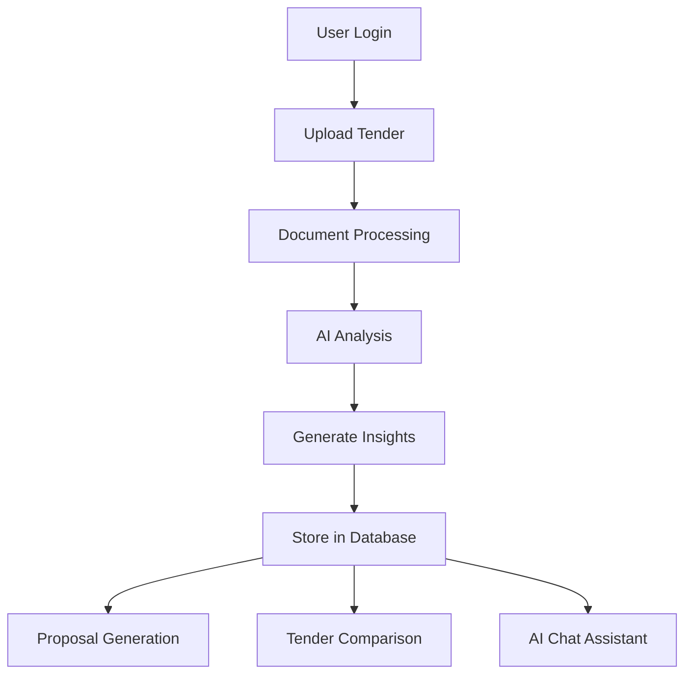

# 🚀 TenderNova

### AI-Powered Tender Intelligence Platform

Transforming tender management with AI-driven analysis, proposal generation, opportunity comparison, and intelligent procurement workflows.

 

  

 

---

## ✨ Overview

TenderNova is a production-ready AI SaaS platform that simplifies tender management through intelligent document processing and automation.

Users can:

* 📄 Upload tender documents
* 🤖 Receive AI-powered analysis
* 📝 Generate professional proposals
* 📊 Compare tender opportunities
* 💬 Interact with documents using AI chat
* 📈 Track activities through a modern dashboard

---

## 🔥 Features

### 🤖 AI Tender Analysis

* Automatic Tender Summarization
* Eligibility Detection
* Budget & Deadline Extraction
* Risk Assessment
* Key Requirement Identification
* Opportunity Insights

### 📝 AI Proposal Generator

* AI-Based Proposal Creation
* Context-Aware Content
* Editable Proposal Workflow
* Professional Document Generation

### 📊 Tender Comparison

* Compare Multiple Opportunities
* AI Scoring Engine
* Risk Evaluation
* Winner Recommendation

### 💬 AI Chat Assistant

* Ask Questions About Documents
* Instant Context-Aware Responses
* Intelligent Tender Exploration

### 🔒 Security & Authentication

* Google OAuth Login
* Protected Routes
* Role-Based Access Control
* Secure Database Operations

---

## 🛠 Tech Stack

| Layer          | Technology                  |
| -------------- | --------------------------- |
| Frontend       | Next.js, React, TypeScript  |
| Styling        | Tailwind CSS, Framer Motion |
| Authentication | NextAuth                    |
| Database       | PostgreSQL, Neon            |
| ORM            | Prisma                      |
| AI             | Mistral AI                  |
| Email          | Resend                      |
| Charts         | Recharts                    |
| Deployment     | Vercel                      |

---

## ⚙️ Workflow

---

## 🚀 Key Modules

| Module            | Description            |
| ----------------- | ---------------------- |
| Dashboard         | Tender Analytics       |
| Upload Center     | Document Upload        |
| Proposal Studio   | AI Proposal Generation |
| Comparison Engine | Tender Evaluation      |
| AI Assistant      | Tender Chat            |
| Admin Panel       | Monitoring & Controls  |

---

## 📈 Future Roadmap

* Multi-Workspace Support
* Cloud Storage Integration
* Smart Tender Alerts
* Advanced OCR Processing
* Team Collaboration
* Analytics Enhancements

---

## 👨‍💻 Developer

### Yug Khatri

---

## ⭐ Vision

TenderNova aims to modernize procurement workflows through Artificial Intelligence, helping organizations save time, reduce manual effort, and identify the most valuable opportunities with confidence.
